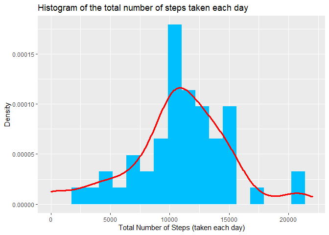
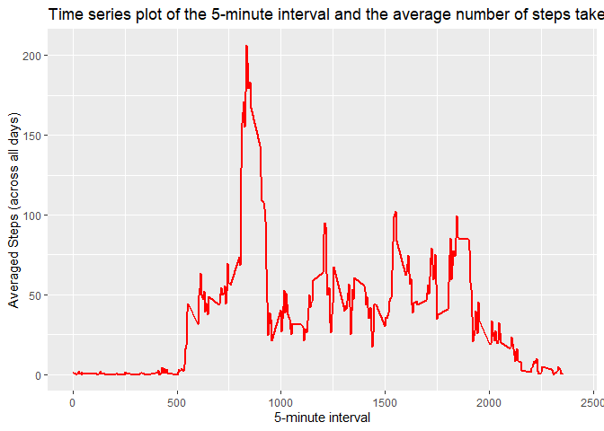
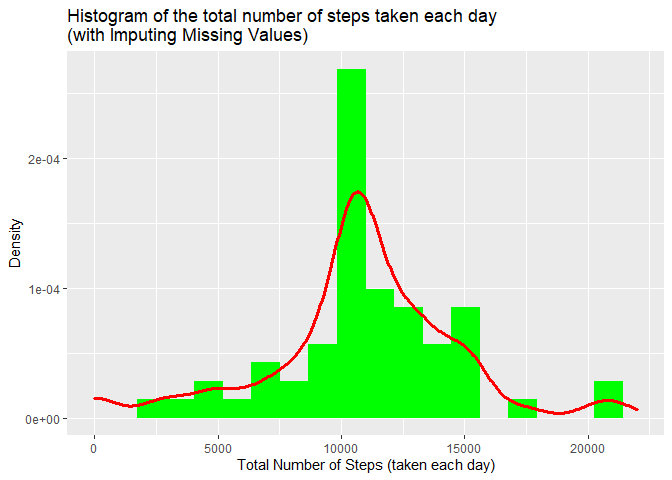
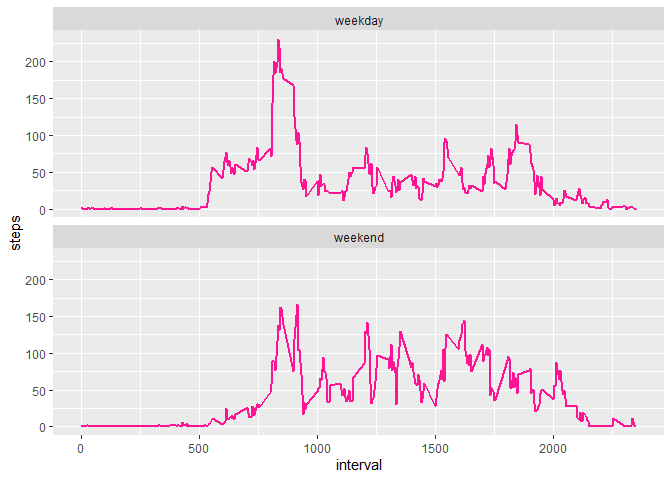

    knitr::opts_chunk$set(echo = TRUE)
    library(readr)
    library(reshape2)
    library(stringr)
    library(data.table)

    ## 
    ## 다음의 패키지를 부착합니다: 'data.table'

    ## The following objects are masked from 'package:reshape2':
    ## 
    ##     dcast, melt

    library(lubridate)

    ## 
    ## 다음의 패키지를 부착합니다: 'lubridate'

    ## The following objects are masked from 'package:data.table':
    ## 
    ##     hour, isoweek, mday, minute, month, quarter, second, wday, week,
    ##     yday, year

    ## The following objects are masked from 'package:base':
    ## 
    ##     date, intersect, setdiff, union

    library(sqldf)

    ## 필요한 패키지를 로딩중입니다: gsubfn

    ## 필요한 패키지를 로딩중입니다: proto

    ## 필요한 패키지를 로딩중입니다: RSQLite

    library(dplyr)

    ## 
    ## 다음의 패키지를 부착합니다: 'dplyr'

    ## The following objects are masked from 'package:data.table':
    ## 
    ##     between, first, last

    ## The following objects are masked from 'package:stats':
    ## 
    ##     filter, lag

    ## The following objects are masked from 'package:base':
    ## 
    ##     intersect, setdiff, setequal, union

    library(ggplot2)
    library(knitr)

    ## global variables
    working_dir <<- 'D:/WorkSpace/Github-R/05.Reproducible-Research'
    relative_path <<- paste0(working_dir, '/Week2/RepData_PeerAssessment1/')
    csv_filename <<- paste0(relative_path, 'activity.csv')

    activity <- NULL
    mutate_activity <- NULL

## A. Loading and preprocessing the data

    ##--------------------
    ## read activity.csv file
    ## [activity.csv Format]
    ## - steps: Number of steps taking in a 5-minute interval (missing values are coded as NA)
    ## - date: The date on which the measurement was taken in YYYY-MM-DD format
    ## - interval: Identifier for the 5-minute interval in which measurement was taken
    ##--------------------
    readActivity <- function() {
        ## check file.exists(), if "file does not exist" then
        if (!file.exists(csv_filename)) {
            print(paste0(csv_filename, ' does not exist! Please check exact filename.'))
        }
        
        ## read activity.csv file
        activity <- as.data.frame(fread(csv_filename))   # fread() is fast and efficient rather than read.csv().

        ## change type to Date
        activity$date <- as.Date(activity$date)

        ## structure
        # str(activity)
        # 'data.frame': 17568 obs. of  3 variables:
        # $ steps   : int  NA NA NA NA NA NA NA NA NA NA ...
        # $ date    : Date, format: "2012-10-01" "2012-10-01" "2012-10-01" "2012-10-01" ...
        # $ interval: int  0 5 10 15 20 25 30 35 40 45 ...

        ## change LOCALE to "English"
        Sys.setlocale("LC_TIME", "English") 
        
        ## add the day of the week 
        activity$wday1 <- wday(activity$date, label=TRUE)
        
        ## add new column with 'weekday' and 'weekend' values
        activity$wday <- 'weekday'
        
        ## update wday column value into "weekend", if (wday1=='Sat' | wday1=='Sun')
        activity[which(activity$wday1=='Sat' | activity$wday1=='Sun'), ]['wday'] <- 'weekend'
                  
        ## change "wday" column type to factor            
        activity$wday <- factor(activity$wday)
        
         ## count rows, if (wday1=='Sat' | wday1=='Sun')
        nrow(filter(activity, (wday1=='Sat' | wday1=='Sun')))   # 4608 rows
        
        table(activity$wday)
        # weekday weekend 
        # 12960    4608 
        
        ## structure
        str(activity)
        # 'data.frame': 17568 obs. of  5 variables:
        # $ steps   : int  NA NA NA NA NA NA NA NA NA NA ...
        # $ date    : Date, format: "2012-10-01" "2012-10-01" "2012-10-01" "2012-10-01" ...
        # $ interval: int  0 5 10 15 20 25 30 35 40 45 ...
        # $ wday1   : Ord.factor w/ 7 levels "Sun"<"Mon"<"Tue"<..: 2 2 2 2 2 2 2 2 2 2 ...
        # $ wday    : Factor w/ 2 levels "weekday","weekend": 1 1 1 1 1 1 1 1 1 1 ...
        
        ## dimension
        dim(activity)  # 17568, 4
        
        ## head()
        head(activity, 3)

        ## return to original LOCALE
        Sys.setlocale() 
        
        summary(activity$steps)
        # Min. 1st Qu.  Median    Mean 3rd Qu.    Max.    NA's 
        # 0.00    0.00    0.00   37.38   12.00  806.00    2304 
        
        ## remove "wday1" column
        activity <- select(activity, c(1, 2, 3, 5))
        
        return(activity)
    }

    ##--------------------
    ## A. Loading and preprocessing the data
    ## 2. read activity.csv file
    ##--------------------
    activity <- readActivity()

    ## 'data.frame':    17568 obs. of  5 variables:
    ##  $ steps   : int  NA NA NA NA NA NA NA NA NA NA ...
    ##  $ date    : Date, format: "2012-10-01" "2012-10-01" ...
    ##  $ interval: int  0 5 10 15 20 25 30 35 40 45 ...
    ##  $ wday1   : Ord.factor w/ 7 levels "Sun"<"Mon"<"Tue"<..: 2 2 2 2 2 2 2 2 2 2 ...
    ##  $ wday    : Factor w/ 2 levels "weekday","weekend": 1 1 1 1 1 1 1 1 1 1 ...

## B. What is mean total number of steps taken per day?

#### 1. Calculate the total number of steps taken per day.

#### 2. Make a histogram of the total number of steps taken each day.

#### 3. Calculate and report the mean and median of the total number of steps taken per day.

    ##--------------------
    ## Create Histogram()
    ##--------------------
    createHistogram <- function(activity) {
        ## 1. group by each day, calculate the total number of steps taken per day.
        activity_groupby_date <- aggregate(steps ~ date, activity, sum)
        
        summary(activity_groupby_date$steps)
        # Min. 1st Qu.  Median    Mean 3rd Qu.    Max. 
        # 41    8841   10765   10766   13294   21194 
        
        ## 2. histogram of the total number of steps taken each day
        g <- ggplot(activity_groupby_date, aes(x=steps)) + 
            geom_histogram(aes(y=..density..), bins=20, fill='deepskyblue', na.rm=TRUE) + 
            geom_density(alpha = 0.2, na.rm = TRUE, color='red', lwd=1.2) +
            ggtitle('Histogram of the total number of steps taken each day') +
            scale_x_continuous(name='Total Number of Steps (taken each day)'
                               , limits=c(0, 22000)) +
            scale_y_continuous(name='Density')

        ## show the plot in the window 
        print(g)
        
        ## 3. Mean and median number of steps taken each day
        ## Calculate mean
        print(paste0('Mean of the number of steps taken each day: '
                       , round(mean(activity_groupby_date$steps),2)))     # 10766.19
        
        ## Calculate median 
        print(paste0('Median of the number of steps taken each day: '
                       , round(median(activity_groupby_date$steps),2)))   # 10765

    } 

    ##--------------------
    ## B. What is mean total number of steps taken per day?
    ## 3. Create a histogram
    ##--------------------
    createHistogram(activity) 

    ## [1] "Mean of the number of steps taken each day: 10766.19"
    ## [1] "Median of the number of steps taken each day: 10765"

## C. What is the average daily activity pattern?

#### 1. Make a time series plot of the 5-minute interval (x-axis) and the average number of steps taken, averaged across all days (y-axis).

#### 2. Which 5-minute interval, on average across all the days in the dataset, contains the maximum number of steps?

    ##--------------------
    ## Create TimeSeries Plot()
    ## C. What is the average daily activity pattern?
    ##--------------------
    createTimeSeriesPlot <- function(activity) {
        
        ## group by each day, get average number of steps taken
        activity_mean_timeseries <- aggregate(steps ~ interval, activity, mean)
        
        summary(activity_mean_timeseries$interval)
        # Min. 1st Qu.  Median    Mean 3rd Qu.    Max. 
        # 0.0   588.8  1177.5  1177.5  1766.2  2355.0 
        
        summary(activity_mean_timeseries$steps)
        # Min. 1st Qu.  Median    Mean 3rd Qu.    Max. 
        # 0.000   2.486  34.113  37.383  52.835 206.170 

        summary(activity$steps)
        # Min. 1st Qu.  Median    Mean 3rd Qu.    Max.    NA's 
        # 0.00    0.00    0.00   37.38   12.00  806.00    2304 

        ## Time Series Plot()
        g <- ggplot(activity_mean_timeseries, aes(x=interval, y=steps)) +
            ggtitle('Time series plot of the 5-minute interval and the average number of steps taken') +
            geom_line(color='red', lwd=1) + 
            scale_x_continuous(name='5-minute interval'
                               , limits=c(0, 2400)) + 
            scale_y_continuous(name='Averaged Steps (across all days)')

        print(g)

        ## c.2. Which 5-minute interval, on average across all the days in the dataset, contains the maximum number of steps?
        ## find index
        max_steps_idx <- activity_mean_timeseries$steps==max(activity_mean_timeseries$steps)
        
        print(paste0('Which 5-minute interval, contains the maximum number of steps? '
                       , activity_mean_timeseries[max_steps_idx, c('interval')]))          # 835

    }

    ##--------------------
    ## C. What is the average daily activity pattern?
    ## 4. Create Time Series Plot
    ##--------------------
    createTimeSeriesPlot(activity)

    ## [1] "Which 5-minute interval, contains the maximum number of steps? 835"

## D. Imputing missing values

#### 1. Calculate and report the total number of missing values in the dataset.

#### 2. Devise a strategy for filling in all of the missing values in the dataset.

#### The strategy does not need to be sophisticated.

#### For example, you could use the mean/median for that day, or the mean for that 5-minute interval, etc.

#### 3. Create a new dataset that is equal to the original dataset but with the missing data filled in.

#### 4. Make a histogram of the total number of steps taken each day and Calculate and report the mean and median total number of steps taken per day.

#### Do these values differ from the estimates from the first part of the assignment?

#### What is the impact of imputing missing data on the estimates of the total daily number of steps?

    ##--------------------
    ## D. Imputing missing values
    ##--------------------
    imputeMissingValues <- function(activity) {
        
        ## D.1 check total number of missing values in the dataset.
        # summary(activity$steps, na.omit=TRUE)[[7]]
        print(paste0('The total number of missing values in the dataset (with NAs): '
                       , sum(is.na(activity$steps))))          # 2304 
        
        ## D.2 Devise a strategy for filling in all of the missing values in the dataset.
        ## use median for that 5-minute interval for NAs.
        
        ## calculate median for 5-minute interval
        median_steps_byinterval <- aggregate(steps ~ interval, activity, median)
        
        print('[Compare median and mean]')
        print(paste0('Calculate median for 5-minute interval: the count (steps==0) is '
                     , sum(median_steps_byinterval$steps==0)  # 235
                     ))

        ## calculate mean for 5-minute interval  ==> use mean value
        mean_steps_byinterval <- aggregate(steps ~ interval, activity, mean)

        print(paste0('Calculate mean for 5-minute interval: the count (steps==0) is '
                     , sum(mean_steps_byinterval$steps==0)  # 19
                    ))
        
        print(paste0('Thus, Use [mean] for imputing missing values!'))

        ## full_join()
        mutate_activity <- NULL
        mutate_activity <- full_join(activity, mean_steps_byinterval, by='interval') 

        ## filter() data with NAs
        na_index_for_steps <- is.na(mutate_activity$steps.x)==TRUE
        
        ## mutate NAs into mean for 5-minute interval 
        mutate_activity[na_index_for_steps, c('steps.x')] <- mutate_activity[na_index_for_steps, c('steps.y')]
        
        ## rename
        mutate_activity <- rename(mutate_activity, c('steps' = 'steps.x'))
        mutate_activity <- select(mutate_activity, -c('steps.y'))   # remove mean, steps.y column
        
        ## check NAs 
        summary(mutate_activity$steps, na.omit=TRUE)
        # Min. 1st Qu.  Median    Mean 3rd Qu.    Max. 
        # 0.00    0.00    0.00   37.38   27.00  806.00 

        ## create Histogram with imputing missing values
        createHistogramWithImputingMissingValues(activity, mutate_activity)
       
        return(mutate_activity)
    }

    ##--------------------
    ## D.4 Make a histogram of the total number of steps taken each day and Calculate and report the mean and median total number of steps taken per day.
    ##--------------------
    createHistogramWithImputingMissingValues <- function(activity, mutate_activity) {
        
        ## data before imputing NAs
        activity_groupby_date <- aggregate(steps ~ date, activity, sum)
        summary(activity_groupby_date$steps)
        # Min. 1st Qu.  Median    Mean 3rd Qu.    Max. 
        # 41    8841   10765   10766   13294   21194 

        ## data after imputing NAs
        ## 1. group by each day, calculate the total number of steps taken per day. (imputing NAs)
        mutate_activity_groupby_date <- aggregate(steps ~ date, mutate_activity, sum)
        summary(mutate_activity_groupby_date$steps)
        # Min. 1st Qu.  Median    Mean 3rd Qu.    Max. 
        # 41    9819   10766   10766   12811   21194 
        
        ## 2. histogram of the total number of steps taken each day
        g <- ggplot(mutate_activity_groupby_date, aes(x=steps)) + 
            geom_histogram(aes(y=..density..), bins=20, fill='green', na.rm=TRUE) + 
            geom_density(alpha = 0.2, na.rm = TRUE, color='red', lwd=1.2) +
            ggtitle('Histogram of the total number of steps taken each day \n(with Imputing Missing Values)') +
            scale_x_continuous(name='Total Number of Steps (taken each day)'
                               , limits=c(0, 22000)) +
            scale_y_continuous(name='Density')
        
        ## show the plot in the window 
        print(g)
        
        ## 4. Calculate and report the mean and median total number of steps taken per day.
        ## Calculate mean
        print('[Compare]')
        print(paste0('Mean of the number of steps taken each day (with NAs): '
                     , round(mean(activity_groupby_date$steps),2)
                    ))
        print(paste0('Mean of the number of steps taken each day (with imputing missing values): '
                     , round(mean(mutate_activity_groupby_date$steps),2)
                     ))     
        
        ## Calculate median 
        print(paste0('Median of the number of steps taken each day (with NAs): '
                     , round(median(activity_groupby_date$steps),2)
                    ))
        print(paste0('Median of the number of steps taken each day (with imputing missing values): '
                     , round(median(mutate_activity_groupby_date$steps),2)
                     ))   
        
        print(paste0('[Conclusion] mean value was not changed. But, median value was changed after imputing missing values!!!'))
        print('Overall, the data distribution is almost unchanged.')    

    } 

    ##--------------------
    ## D. Imputing missing values
    ## 5. Create Histogram with imputing missing values
    ##--------------------
    mutate_activity <- imputeMissingValues(activity)  # mutate NAs

    ## [1] "The total number of missing values in the dataset (with NAs): 2304"
    ## [1] "[Compare median and mean]"
    ## [1] "Calculate median for 5-minute interval: the count (steps==0) is 235"
    ## [1] "Calculate mean for 5-minute interval: the count (steps==0) is 19"
    ## [1] "Thus, Use [mean] for imputing missing values!"

    ## [1] "[Compare]"
    ## [1] "Mean of the number of steps taken each day (with NAs): 10766.19"
    ## [1] "Mean of the number of steps taken each day (with imputing missing values): 10766.19"
    ## [1] "Median of the number of steps taken each day (with NAs): 10765"
    ## [1] "Median of the number of steps taken each day (with imputing missing values): 10766.19"
    ## [1] "[Conclusion] mean value was not changed. But, median value was changed after imputing missing values!!!"
    ## [1] "Overall, the data distribution is almost unchanged."

## E. Are there differences in activity patterns between weekdays and weekends?

    ##--------------------
    ## E. Are there differences in activity patterns between weekdays and weekends?
    ## 6. Create Time Series Plot (weekday days or weekend days)
    ##--------------------
    createTimeSeriesPlotForWeekdaysWeekends <- function(mutate_activity) {
        
        ## structure of mutate_activity (dataset with mutating missing values)
        str(mutate_activity)
        # 'data.frame': 17568 obs. of  4 variables:
        # $ steps   : num  1.717 0.3396 0.1321 0.1509 0.0755 ...
        # $ date    : Date, format: "2012-10-01" "2012-10-01" "2012-10-01" "2012-10-01" ...
        # $ interval: int  0 5 10 15 20 25 30 35 40 45 ...
        # $ wday    : Factor w/ 2 levels "weekday","weekend": 1 1 1 1 1 1 1 1 1 1 ...
        
        head(mutate_activity, 3)
        # steps       date interval    wday
        # 1 1.7169811 2012-10-01        0 weekday
        # 2 0.3396226 2012-10-01        5 weekday
        # 3 0.1320755 2012-10-01       10 weekday

        ## group by each day, get average number of steps taken
        mutate_activity_mean_timeseries <- aggregate(steps ~ interval + wday, mutate_activity, mean)
        
        summary(mutate_activity_mean_timeseries$interval)
        # Min. 1st Qu.  Median    Mean 3rd Qu.    Max. 
        # 0.0   588.8  1177.5  1177.5  1766.2  2355.0 

        ## Time Series Plot()
        g <- ggplot(mutate_activity_mean_timeseries, aes(x=interval, y=steps)) +
            geom_line(color='deeppink', lwd=1) + 
            facet_wrap(. ~ wday, nrow=2, ncol=1)
            ggtitle('Time series plot of the 5-minute interval and the average number of steps taken \n(between weekdays and weekends)') +
            scale_x_continuous(name='5-minute interval'
                               , limits=c(0, 2400)) + 
            scale_y_continuous(name='Average number of steps taken (across all days)')
        
        print(g)
        
        ## [Compare between weekday and weekend]
        ## descriptive statistics of steps for "weekday" 
        weekday_index <- mutate_activity_mean_timeseries$wday=='weekday'
        summary(mutate_activity_mean_timeseries[weekday_index, c('steps')])
        # Min. 1st Qu.  Median    Mean 3rd Qu.    Max. 
        # 0.000   2.247  25.803  35.611  50.854 230.378 
        
        ## standard deviation for "weekday"
        sd(mutate_activity_mean_timeseries[weekday_index, c('steps')])
        # 41.61918
        
        ## descriptive statistics of steps for "weekend" 
        weekend_index <- mutate_activity_mean_timeseries$wday=='weekend'
        summary(mutate_activity_mean_timeseries[weekend_index, c('steps')])
        # Min. 1st Qu.  Median    Mean 3rd Qu.    Max. 
        # 0.000   1.241  32.340  42.366  74.654 166.639 
        
        ## standard deviation for "weekend"
        sd(mutate_activity_mean_timeseries[weekend_index, c('steps')])
        # 42.5439
        
        print('[Conclusion]')
        print(paste0('On weekdays (steps), mean is '
                     , round(mean(mutate_activity_mean_timeseries[weekday_index, c('steps')]), 3)
                     , ', median is '
                     , round(median(mutate_activity_mean_timeseries[weekday_index, c('steps')]), 3)
                     , ', and standard deviation is '
                     , round(sd(mutate_activity_mean_timeseries[weekday_index, c('steps')]), 3)
                     , '.'
                     ))
        
        print(paste0('On weekends (steps), mean is '
                     , round(mean(mutate_activity_mean_timeseries[weekend_index, c('steps')]), 3)
                     , ', median is '
                     , round(median(mutate_activity_mean_timeseries[weekend_index, c('steps')]), 3)
                     , ', and standard deviation is '
                     , round(sd(mutate_activity_mean_timeseries[weekend_index, c('steps')]), 3)
                     , '.'
        ))

        print('The mean, median, and standard deviation of weekend steps are slightly larger than weekdays.')

    }

    ##--------------------
    ## E. Are there differences in activity patterns between weekdays and weekends?
    ## 6. Create Time Series Plot (weekday days or weekend days)
    ##--------------------
    createTimeSeriesPlotForWeekdaysWeekends(mutate_activity)

    ## 'data.frame':    17568 obs. of  4 variables:
    ##  $ steps   : num  1.717 0.3396 0.1321 0.1509 0.0755 ...
    ##  $ date    : Date, format: "2012-10-01" "2012-10-01" ...
    ##  $ interval: int  0 5 10 15 20 25 30 35 40 45 ...
    ##  $ wday    : Factor w/ 2 levels "weekday","weekend": 1 1 1 1 1 1 1 1 1 1 ...

    ## [1] "[Conclusion]"
    ## [1] "On weekdays (steps), mean is 35.611, median is 25.803, and standard deviation is 41.619."
    ## [1] "On weekends (steps), mean is 42.366, median is 32.34, and standard deviation is 42.544."
    ## [1] "The mean, median, and standard deviation of weekend steps are slightly larger than weekdays."
